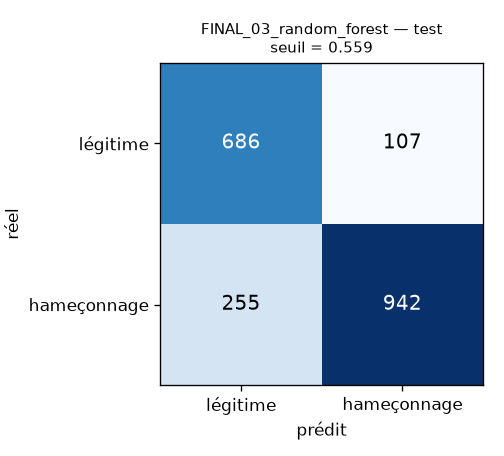
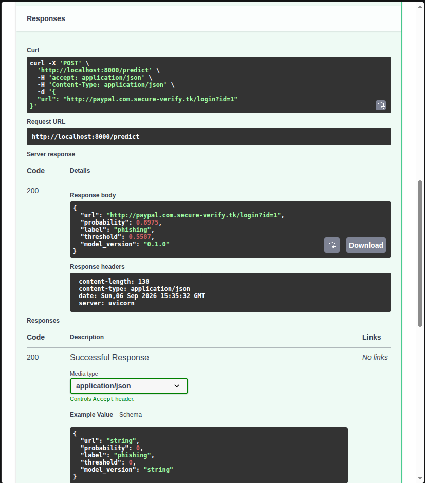

# phishing-url-detector


Classifie une URL comme hameçonnage ou légitime à partir de sa seule chaîne de caractères, servi comme une API HTTP.

## Le problème

Le hameçonnage repose sur des URLs qui imitent des marques légitimes tout en restant syntaxiquement valides : aucune règle simple ne les sépare. Les listes noires sont réactives par construction — une URL de hameçonnage vit souvent quelques heures, moins que le délai nécessaire à son signalement. Il faut donc trancher sur la seule chaîne de caractères, sans visiter la page : la visiter serait trop lent pour une passerelle mail ou un proxy, et reviendrait à télécharger du contenu hostile.

## L'approche

**23 caractéristiques lexicales, sans aucun accès réseau** — longueurs, comptages, ratios, entropie de Shannon de l'hôte, détection d'IP, de punycode, de raccourcisseur, de TLD abusé, de vocabulaire d'ingénierie sociale. Extraction mesurée à **19 µs par URL**, ce qui rend la décision compatible avec un point de passage réseau.

**Split par domaine enregistrable, pas aléatoire.** Mesure préalable sur le corpus : **51,8 % des URLs partagent leur domaine avec au moins une autre** (`blogspot.com` à lui seul en compte 383). Un découpage aléatoire disperserait ces URLs des deux côtés de la frontière et le modèle serait évalué sur des domaines déjà mémorisés — de la récitation, pas de la généralisation. `GroupShuffleSplit` groupé par eTLD+1 l'empêche.

**scikit-learn plutôt qu'un réseau de neurones.** Sur 23 variables tabulaires et 11 429 exemples, les modèles à base d'arbres dominent, s'entraînent en moins d'une seconde, servent sur CPU en millisecondes et fournissent des importances de variables — ce qui compte en cybersécurité, où un analyste doit pouvoir justifier un blocage. Cinq configurations sont comparées, de la référence plancher (`DummyClassifier`) au TF-IDF de n-grammes de caractères.

**MLflow** pour tracer les configurations comparées. **FastAPI** pour la validation Pydantic et la documentation automatiques, avec le modèle chargé une seule fois au démarrage via `lifespan`. **Docker multi-étapes** : l'étape de construction installe les dépendances, l'étape finale repart d'une base propre et ne copie que les paquets installés. Mesuré contre une version naïve (base complète, une seule étape, outillage de développement embarqué) : **720 Mo contre 3,24 Go**, soit 4,5 fois moins. L'image finale ne contient ni `gcc`, ni `pip`, ni `pytest`, ni `mlflow`, et le processus tourne en utilisateur non privilégié.

**GitHub Actions** : `lint` (ruff) et `test` (pytest) tournent en parallèle, puis `docker` seulement si les deux passent — on ne construit pas d'image à partir de code cassé. Le job Docker ne se contente pas de construire : il vérifie que le processus tourne en `appuser`, que `gcc`, `pytest` et `mlflow` sont absents de l'image, et que l'API répond correctement à une vraie requête.

Le **modèle est versionné dans le dépôt** (6,9 Mo compressés) pour que `docker compose up` fonctionne après un simple clone. Git n'est pas fait pour les binaires, mais à cette taille le compromis est raisonnable — en production, ce serait un registre de modèles.

### Corpus

| Jeu | Rôle |
|---|---|
| `pirocheto/phishing-url` — 11 429 URLs, 50/50 | entraînement, validation, test |
| PhishTank (flux vivant) | évaluation sur du hameçonnage postérieur à l'entraînement |
| Tranco top 1M | mesure du taux de faux positifs sur du trafic légitime |

PhishTank et Tranco servent **uniquement** à l'évaluation externe. Les utiliser à l'entraînement apprendrait au modèle que « une URL avec un chemin est du hameçonnage », puisque PhishTank fournit des URLs complètes et Tranco des domaines nus : un biais de construction du corpus, qui donnerait un score excellent et un détecteur inutilisable.

### Architecture

```
                   ┌───────────────────────────────────────────┐
   data.py   ─────▶│  11 429 URLs  (parquet Hugging Face)      │
                   └──────────────────┬────────────────────────┘
                                      │  registrable_domain()
                   ┌──────────────────▼────────────────────────┐
   train.py  ─────▶│  GroupShuffleSplit par domaine  70/15/15  │
                   │  5 configurations tracées sous MLflow     │
                   └──────────────────┬────────────────────────┘
                                      │  joblib
                   ┌──────────────────▼────────────────────────┐
   api.py    ─────▶│  Pipeline(features → RandomForest)        │
                   │  chargé une fois au démarrage (lifespan)  │
                   └──────────────────┬────────────────────────┘
                                      ▼
                        POST /predict → {probability, label}
```

## Résultat

### Ce qui marche

**Comparaison des configurations** (métriques de validation ; le seuil de chaque modèle est calibré pour tenir une précision ≥ 90 %) :

| Configuration | Rappel | Précision | PR-AUC |
|---|---|---|---|
| `01_dummy_majoritaire` (référence plancher) | 0,000 | 0,000 | 0,515 |
| `02_logreg` | 0,674 | 0,900 | 0,895 |
| **`03_random_forest`** — *expédié* | **0,843** | **0,900** | **0,945** |
| `04_hist_gradient_boosting` | 0,799 | 0,901 | 0,943 |
| `05_tfidf_char_logreg` — *benchmark, écarté* | 0,885 | 0,900 | 0,964 |

**Modèle retenu, sur le jeu de test touché une seule fois** (seuil = 0,559) :

| Rappel | Précision | F1 | Exactitude | PR-AUC | ROC-AUC |
|---|---|---|---|---|---|
| 78,7 % | 89,8 % | 83,9 % | 81,8 % | 94,5 % | 92,1 % |



**Fuite de données, mesurée sur 5 tirages** (PR-AUC de test, même algorithme) :

| Découpage | PR-AUC |
|---|---|
| Groupé par domaine | 0,9051 ± 0,0248 |
| Aléatoire | 0,9538 ± 0,0045 |

Le découpage aléatoire **surestime le modèle de 4,9 points** de PR-AUC. Il produit aussi un écart-type cinq fois plus faible : non seulement il flatte le score, mais il donne une fausse impression de stabilité, parce que chaque tirage réévalue les mêmes domaines.



**API et latence.** `POST /predict` répond en **11,8 ms** de bout en bout, `POST /predict/batch` en **0,12 ms par URL** sur un lot de 100. Le modèle est chargé une fois au démarrage (`lifespan`), en 0,1 s ; l'extraction des caractéristiques coûte 19 µs.

Deux réglages ont été nécessaires pour y arriver, et ils illustrent que les paramètres optimaux à l'entraînement et au service diffèrent :

| Réglage | Avant | Après |
|---|---|---|
| `n_jobs` de la forêt aléatoire (`-1` → `1`) | 65,8 ms | 11,8 ms |
| `/predict/batch` vectorisé (une passe au lieu d'une boucle) | 8,7 ms/URL | 0,12 ms/URL |

Sur une seule URL, coordonner 300 arbres entre threads coûte sept fois plus cher que le calcul lui-même. Les prédictions sont identiques dans les deux cas : ce sont des optimisations de service, pas des changements de modèle.

**Conteneur vérifié de bout en bout.** `docker compose up` sert l'API en **13,4 ms** par requête contre 11,8 ms sur l'hôte, l'état de santé passe à `healthy`, et la prédiction est identique à celle obtenue hors conteneur (`0.8975` dans les deux cas) — la promesse de la conteneurisation, vérifiée plutôt que supposée.

**74 tests en 2,2 s** : extraction de caractéristiques (dont 13 entrées dégénérées qui ne doivent jamais lever), invariants du découpage anti-fuite, contrat de l'API, et non-régression du modèle expédié.

### Ce qui ne marche pas

**Le meilleur modèle du benchmark est inutilisable.** `05_tfidf_char_logreg` (n-grammes de caractères) bat le modèle retenu de 13 points de rappel sur le test interne. Confronté à des données réelles, il classe **89,5 % des domaines du top Tranco comme du hameçonnage** :

| Modèle | Test interne | Rappel sur hameçonnage frais | Faux positifs (Tranco) |
|---|---|---|---|
| `03_random_forest` | 78,7 % | 73,1 % | **1,2 %** |
| `05_tfidf_char_logreg` | 91,8 % | 67,0 % | **89,5 %** |

Il n'a aucune notion de la structure d'une URL : il mémorise des sous-chaînes du corpus de 2020. C'est la raison pour laquelle le modèle expédié est celui qui perd le benchmark de 13 points. Un score de test n'est pas un critère de mise en production. Reproductible via `python scripts/eval_external.py`.

**Un hameçonnage sur cinq passe.** 78,7 % de rappel signifie 21,3 % de faux négatifs sur le test interne, et 26,9 % sur du hameçonnage frais collecté six ans après le corpus d'entraînement. La dégradation est réelle : les campagnes actuelles abusent d'hébergeurs légitimes (`netlify.app`, `pages.dev`) absents du corpus.

**13,5 % de faux positifs sur des URLs légitimes réelles.** Le 1,2 % mesuré sur Tranco flatte le modèle : Tranco ne contient que des **domaines nus**, sans chemin ni paramètres. Sur les URLs légitimes complètes du jeu de test (n = 793), le taux monte à **13,5 %**. Exemple concret : `https://github.com/moh4med-craft` est classé hameçonnage à 0,751 — un tiret et un chiffre dans le chemin suffisent à le faire basculer. Plusieurs URLs banales se situent d'ailleurs juste sous le seuil (`amazon.fr/dp/…` à 0,444, `google.com/search?q=…` à 0,466) : le modèle est peu confiant sur du trafic ordinaire, et un déploiement réel exigerait une liste d'exclusion des domaines de premier plan.

**Les URLs relatives au protocole.** `//evil.com` produit un hôte vide : `urlsplit` ne sait pas interpréter `http:////evil.com`.

**Les IP obfusquées.** `http://0177.0.0.1/` (octal) et `http://2130706433/` (décimal) échappent à la détection d'IP, qui n'accepte que la notation décimale pointée canonique.

**Le domaine enregistrable est une heuristique, pas la Public Suffix List.** Les suffixes composés fréquents (`co.uk`, `com.br`…) sont codés en dur ; la liste exacte imposerait une dépendance qui télécharge sa table au premier appel, en contradiction avec la règle « aucun accès réseau ». Choix volontairement conservateur : `blogspot.com` et `netlify.app` ne sont pas traités comme des suffixes publics, donc leurs sous-domaines forment un seul groupe au moment du split — un regroupement plus grossier que la réalité, mais qui protège mieux de la fuite de données.

**L'âge du domaine n'est pas implémenté.** Le corpus date de 2020 : un WHOIS effectué aujourd'hui attribuerait six ans d'ancienneté à un domaine qui en avait trois jours au moment de l'attaque — une fuite temporelle. S'y ajouteraient environ une seconde de latence par requête et une dépendance externe faillible.

**Aucune défense contre un attaquant adaptatif.** Ces caractéristiques sont contournables par construction. Mesuré : sur huit URLs imitant simplement le profil d'un site légitime, **cinq passent au travers**. Pire, le modèle a appris que `www.` signifie « légitime » (66,8 % des URLs saines du corpus contre 20,5 % des hameçonnages) : ajouter ce préfixe divise le score par six et fait basculer le verdict.

**Sur du trafic réel, dix-neuf alertes sur vingt seraient fausses.** Le corpus est équilibré 50/50, le trafic réel contient moins de 1 % de hameçonnage : à taux d'erreur identiques, la précision réelle tombe de 85,4 % à **5,6 %**. C'est l'effet du taux de base, inhérent à toute détection d'événement rare.

> Le détail de ces analyses, le curseur du seuil de décision et les limites structurelles sont développés dans [REFLEXION.md](REFLEXION.md).

## Lancer le projet

```
docker compose up
```

Puis http://localhost:8000/docs

Pour reproduire l'entraînement et les mesures :

```
pip install -r requirements-dev.txt && pip install -e .
python -m phishing_detector.train    # 5 configurations + étude de fuite (~20 s)
python scripts/eval_external.py      # évaluation sur PhishTank et Tranco
pytest                               # 74 tests
```
